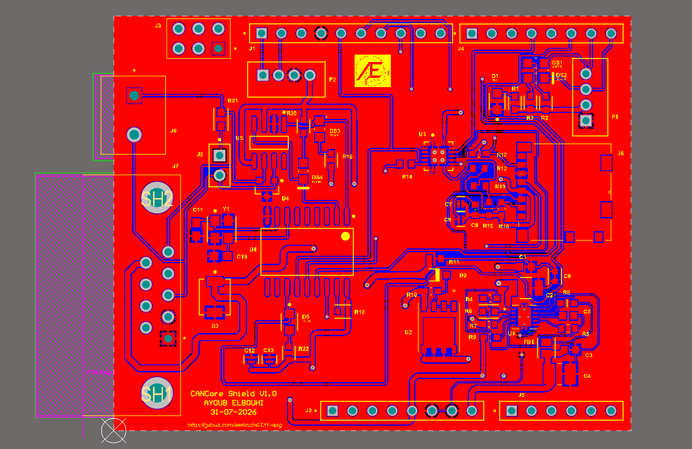
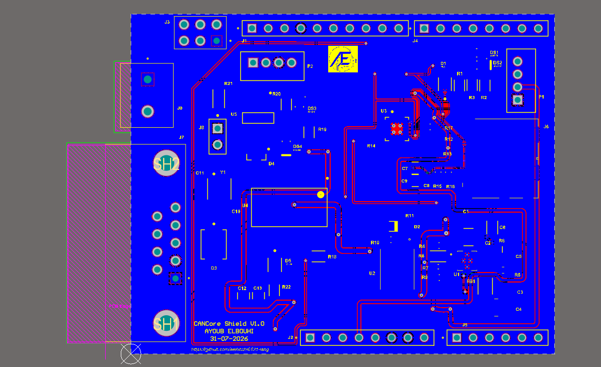
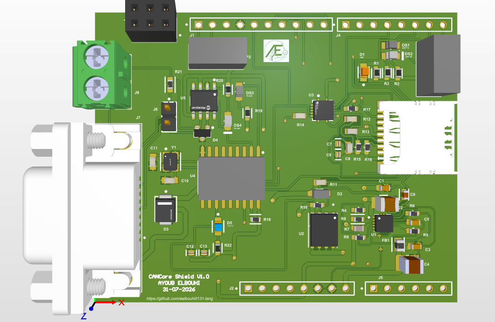

# CANCore Shield


---

## Overview

CANCore Shield is a compact **Arduino UNO CAN-Bus Shield** designed using **Altium Designer** for embedded systems and automotive communication applications.

While inspired by well-known open hardware CAN shield designs, this project was **redesigned, optimized, and enhanced** with several hardware improvements to increase reliability, usability, and compatibility for modern embedded applications.

This repository contains the complete hardware design, including:

- Schematics
- PCB Layout
- 3D Model
- Manufacturing Files (Gerbers)
- Project Documentation

---

# Features

- Arduino UNO Shield Compatible
- CAN-Bus Communication Interface
- microSD Card Interface
- Integrated Power Supply
- Two-Layer PCB
- Complete Design Rule Check (DRC) Verification
- 3D PCB Model Included
- Manufacturing Ready

---

# Design Improvements

Compared to the original reference designs, several engineering improvements were introduced:

### Power Management

- Added a dedicated **ON/OFF power switch** allowing complete board power control without disconnecting the Arduino.
- Improved the overall power distribution network for safer and more convenient development.

### Status LEDs

- Added dedicated status LEDs for quick visual indication of board operation and power status.
- Simplifies debugging and hardware validation during testing.

### Improved microSD Interface

- Added a **bidirectional logic level translator** between the Arduino and the microSD card.
- Ensures safe communication between the Arduino's 5V logic and the SD card's 3.3V interface.
- Protects the SD card while improving communication reliability.

### PCB Layout Optimization

- Optimized component placement for improved accessibility and assembly.
- Improved routing quality for better signal integrity.
- Redesigned ground planes to provide cleaner return paths and reduce electrical noise.

### Thermal Optimization

- Added thermal vias around power components to improve heat dissipation.
- Helps maintain lower operating temperatures during long operating periods.

### Manufacturing Readiness

- Successfully passed **Altium Designer Design Rule Check (DRC)** with **0 Errors**.
- Generated complete manufacturing outputs including Gerber and NC Drill files.

These enhancements make the board more robust, easier to debug, electrically safer, and better suited for embedded development, education, and prototyping.

---

# PCB Preview

## Top Layer



---

## Bottom Layer



---

## 3D View



---

# Repository Structure

```text
CANCoreShield
│
├── Images
│   ├── PCB_3D.png
│   ├── PCB_Back.png
│   ├── PCB_Top.png
│   └── README.md
│
├── Manufacturing
│   ├── CANCoreShield_Gerbers.zip
│   └── .gitkeep
│
├── Schematics
│   ├── TOP_Sheet.SchDoc
│   ├── 01_Arduino_IO.SchDoc
│   ├── 02_CAN.SchDoc
│   ├── 03_SD_Card.SchDoc
│   ├── 04_Power.SchDoc
│   └── README.md
│
├── CANCore Shield 3D View.step
├── CANCore Shield.OutJob
├── CANCore Shield.PcbDoc
├── CANCore Shield.PrjPcb
└── CANCore Shield.pdf
```

---

# Schematics

The project is divided into four functional schematic blocks:

- Arduino I/O Interface
- CAN Communication
- microSD Card Interface
- Power Supply

All schematic source files are available inside:

```text
Schematics/
```

---

# PCB Design

The PCB was developed entirely using **Altium Designer**, including:

- Schematic Capture
- PCB Layout
- Interactive Routing
- Copper Pour
- Design Rule Verification (DRC)
- 3D Mechanical Verification

## Final DRC Status

 **0 Errors**

---

# Manufacturing

Fabrication files are available inside:

```text
Manufacturing/
```

Contents include:

- Gerber Files
- NC Drill Files

Ready for PCB fabrication using manufacturers such as **JLCPCB**, **PCBWay**, and similar PCB fabrication services.

---

# 3D Model

A complete STEP model is included for mechanical integration and enclosure design.

```text
CANCore Shield 3D View.step
```

---

# Documentation

Project documentation is available in:

```text
CANCore Shield.pdf
```

---

# Software Used

- Altium Designer
- CAMtastic
- Design Rule Check (DRC)

---

# Author

**Ayoub ELBOUHI**

Electrical Engineering & Embedded Systems Student

ENSA Marrakech

GitHub:
https://github.com/aelbouhi0131
